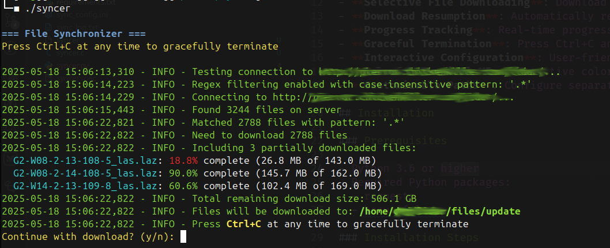

# File Synchronizer

[](https://opensource.org/licenses/MIT)

A robust tool for synchronizing files from a password-protected server with support for download resumption, progress tracking, regex filtering, and graceful termination.



## Features

- **Selective File Downloading**: Download only files matching your custom regex patterns
- **Download Resumption**: Automatically resumes partially downloaded files
- **Progress Tracking**: Real-time progress bars with speed and ETA estimation
- **Graceful Termination**: Press Ctrl+C anytime to safely terminate downloads
- **Interactive Configuration**: User-friendly setup for server credentials and file filtering
- **Colorful Terminal UI**: Intuitive color-coded interface for easy monitoring
- **Customizable Paths**: Configure separate directories for existing and newly downloaded files

## Installation

### Prerequisites

- Python 3.6 or higher
- Required Python packages:
  - requests
  - beautifulsoup4

### Installation Steps

1. Clone the repository:

   ```bash
   git clone https://github.com/ketukil/syncer.git
   cd syncer
   ```

2. Install dependencies:

   ```bash
   pip install -r requirements.txt
   ```

3. Run the script:

   ```bash
   python syncer.py
   ```

### Using with Virtual Environment

```bash
# Create virtual environment
python -m venv venv

# Activate virtual environment
# On Windows
venv\Scripts\activate
# On Unix or MacOS
source venv/bin/activate

# Install requirements
pip install -r requirements.txt

# Run the program
python syncer.py
```

## Configuration

On first run, the script creates a configuration file (`sync_config.ini`) and walks you through the setup process. You can manually edit this file or use command-line arguments to override settings.

### Sample Configuration File

```ini
[SERVER]
url = http://example.com/files/
username = your_username
password = your_password

[LOCAL]
local_dir = current_files
download_dir = new_downloads

[DOWNLOAD]
max_retries = 3
retry_delay = 5
chunk_size = 8192
progress_update_interval = 1

[FILTER]
enabled = true
pattern = .*
case_sensitive = false
description = Regular expression to filter filenames. Only files matching this pattern will be downloaded. If disabled, no files will be downloaded.
```

## Basic Usage

### First Run

On first run, the script will guide you through setting up:

- Server URL, username, and password
- Local and download directory paths
- File filtering options

### Downloading Files

```bash
# Download all files matching the configured filter pattern
python syncer.py

# Download only .laz files
python syncer.py -e .laz

# Download files matching a specific pattern
python syncer.py --filter "G2-W08-2-.*"
```

## File Filtering

The file filtering system is a core feature of File Synchronizer. When filtering is disabled, **no files will be downloaded**.

### Enabling Filtering

```bash
# Enable filtering with the pattern from config file
python syncer.py --enable-filter

# Enable filtering with a custom pattern (downloads all files starting with G2-W08-2-)
python syncer.py --filter "G2-W08-2-.*"
```

### Pattern Examples

| Pattern            | Description                     | Example Matches                                      |
| ------------------ | ------------------------------- | ---------------------------------------------------- |
| `.*`               | All files                       | Any filename                                         |
| `.*\.laz`          | All .laz files                  | file.laz, data.laz                                   |
| `G2-W08-2-.*`      | Files starting with G2-W08-2-   | G2-W08-2-10-109-6_las.laz                            |
| `.*-(108\|109)-.*` | Files containing -108- or -109- | G2-W08-2-10-109-6_las.laz, G2-W08-2-13-108-5_las.laz |

## Command-Line Arguments

```text
usage: syncer.py [-h] [-c CONFIG] [-e EXTENSION] [-u URL] [--username USERNAME]
                   [--password PASSWORD] [--local-dir LOCAL_DIR]
                   [--download-dir DOWNLOAD_DIR] [--filter FILTER]
                   [--enable-filter] [--disable-filter] [--verbose] [--no-color]

File Synchronizer

options:
  -h, --help            show this help message and exit
  -c CONFIG, --config CONFIG
                        Path to configuration file (default: sync_config.ini)
  -e EXTENSION, --extension EXTENSION
                        File extension to synchronize (e.g. '.laz'). If not specified, all files will be considered.
  -u URL, --url URL     Override server URL from config file
  --username USERNAME   Override server username from config file
  --password PASSWORD   Override server password from config file (not recommended, use config file instead)
  --local-dir LOCAL_DIR
                        Override local directory path from config file
  --download-dir DOWNLOAD_DIR
                        Override download directory path from config file
  --filter FILTER       Override regex filter pattern from config file and enable filtering
  --enable-filter       Enable regex filtering with pattern from config file
  --disable-filter      Disable regex filtering (no files will be downloaded)
  --verbose             Enable verbose logging
  --no-color            Disable colored output
```

## Advanced Usage Examples

### Using a Different Configuration File

```bash
python syncer.py -c custom_config.ini
```

### Overriding Server Credentials

```bash
python syncer.py -u http://newserver.com/files/ --username newuser
```

### Setting Custom Directories

```bash
python syncer.py --local-dir /path/to/existing/files --download-dir /path/to/downloads
```

### Downloading Specific Files

```bash
# Download only files from a specific area (G2-W08-2-*)
python syncer.py --filter "G2-W08-2-.*"

# Download files from specific tiles (108-5 or 109-6)
python syncer.py --filter ".*-(108|109)-.*"
```

### Verbose Logging

```bash
python syncer.py --verbose
```

## Graceful Termination

Press **Ctrl+C** at any time to gracefully terminate the download process. The script will:

1. Complete the current download chunk
2. Properly close the file being downloaded
3. Save download progress for later resumption
4. Show a summary of completed and incomplete downloads

When you run the script again, it will automatically resume from where it left off.

## Building a executable from .py

### With Pyinstaller

```bash
# Install PyInstaller and UPX
pip install pyinstaller
# Download UPX from https://github.com/upx/upx/releases and place in PATH

# Create a minimal executable
pyinstaller --onefile --clean --noupx syncer.py

# For even smaller size, use UPX compression
pyinstaller --onefile --clean --upx-dir=/path/to/upx syncer.py

# Further PyInstaller Optimizations
pyinstaller --onefile --clean --upx-dir=/path/to/upx --strip --exclude-module _ssl --exclude-module _socket --exclude-module unicodedata syncer.py
```
### Using a .spec file

```bash
# Building with .spec file
pyinstaller --clean syncer.spec
```

### With Nuitka

```bash
# Install Nuitka
pip install nuitka

# Install patchelf
sudo apt install patchelf

# Basic compilation
python -m nuitka --follow-imports --standalone --output-dir=out syncer.py

# For smaller size
python -m nuitka --follow-imports --standalone --remove-output --no-pyi-file --output-dir=out --lto=yes syncer.py
```

### With Cython

```bash
# Install Cython
pip install cython

# Convert Python to C
cython --embed -o syncer.c syncer.py

# Compile with minimal dependencies (Linux example)
gcc -Os -I /usr/include/python3.12 -o syncer syncer.c -lpython3.12 -lm -lutil -ldl
```

## Troubleshooting

### Connection Issues

If you experience connection problems:

1. Verify your server credentials in the configuration file
2. Check that the server URL is correct and includes the trailing slash
3. Ensure your network allows connections to the server
4. Try increasing the `retry_delay` in the configuration file

### Filtering Not Working

1. Make sure filtering is enabled (`enabled = true` in the `[FILTER]` section)
2. Verify your regex pattern is correct
3. Run with `--verbose` to see detailed logging of the filtering process

### Partial Downloads

If files are consistently failing to download completely:

1. Check your internet connection stability
2. Increase the `max_retries` value in the configuration file
3. Verify you have sufficient disk space

## Contributing

Contributions are welcome! Please feel free to submit a Pull Request.

1. Fork the repository
2. Create your feature branch (`git checkout -b feature/amazing-feature`)
3. Commit your changes (`git commit -m 'Add some amazing feature'`)
4. Push to the branch (`git push origin feature/amazing-feature`)
5. Open a Pull Request

## License

This project is licensed under the MIT License - see the LICENSE file for details.

## Acknowledgments

- [Beautiful Soup](https://www.crummy.com/software/BeautifulSoup/) for HTML parsing
- [Requests](https://requests.readthedocs.io/) for HTTP requests
- [ConfigParser](https://docs.python.org/3/library/configparser.html) for configuration management

---

Created by ketukil - [www.github.com/ketukil](www.github.com/ketukil)
